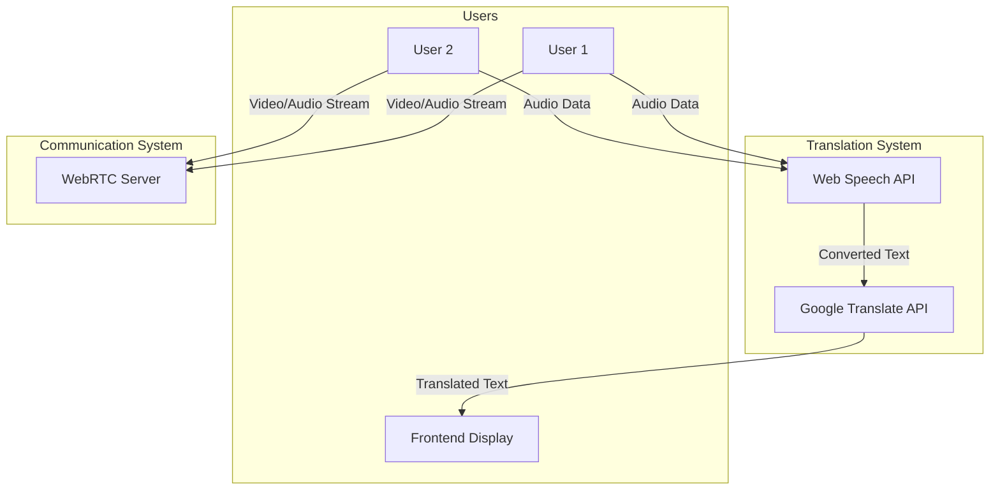
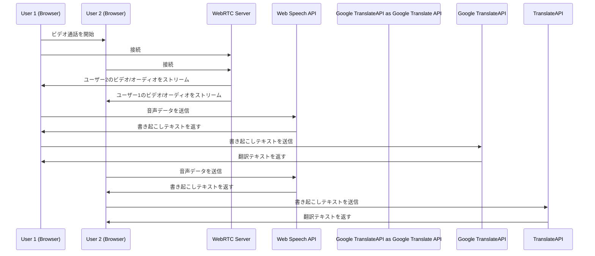

## 概略
ビデオ通話で、自動翻訳を導入したい。
1. WebRTC: ユーザー間でのビデオと音声のストリーミング。
2. Web Speech API: 音声データをリアルタイムでテキストに変換。
3. Google Translate API: テキストを翻訳。
4. フロントエンド: 翻訳されたテキストをリアルタイムで表示。

## 意識してること
- 費用
- レイテンシー
- カスタマイズ性
- 依存関係の少なさ

## アーキテクチャ

## 通信フロー

## 費用
### WebRTC Server
通信経由するためのサーバーを構築せなあかん？
（P2P通信を補完するTURNサーバーなどの維持費用が必要かも）
### SpeechAPI
無料のはず。。
### Google TranslateAPI
Cloud Translation - Basicで足りそう。原文テキストベースで課金。
原文の言語検出等は無料。
|できること|測定使用量|価格|
|--|--|--|
|NMT モデルを使用した言語検出とテキスト翻訳|最初の 500,000 文字 |無料|
|NMT モデルを使用した言語検出とテキスト翻訳|500,001 文字～10 億文字|$20/100 万文字|
|NMT モデルを使用した言語検出とテキスト翻訳|10 億文字超|営業担当者に相談|

## レイテンシー（通信の遅延）で考慮する点
そんな時間かからなそう？
### WebRTC Server
ユーザー間のビデオ・オーディオストリーミングでレイテンシー
### Web Speech APIとGoogle Translate API
音声データの送信とテキストの受け取り、翻訳にも若干のレイテンシー

## 参照 
- [リアルタイム翻訳機能の付いたWeb会議を作ってみた](https://qiita.com/yorifuji/items/9988f9a31c48bae31def)
- [Web Speech API(mdn)](https://developer.mozilla.org/en-US/docs/Web/API/Web_Speech_API)
  - 対応ブラウザ増えてるから、多分使える。
- [Speech-to-TextとWeb Speech APIの違い](https://moonlightdx999.hatenablog.com/entry/2019/02/03/120000)
  - 機密情報使わんなら、Web Speech APIがいい。無料なので
- [WebRTC の STUN, TURN, ICE とは何なのか](https://qiita.com/takano-h/items/409a8a7af7d4a2b42f90)
- [Cloud Translation の料金](https://cloud.google.com/translate/pricing?hl=ja)
  - Cloud Translation が処理するテキストの量に対して課金
  - たとえば、原文の言語を指定せずに 1,000 文字を翻訳する場合、請求は 1,000 文字に対してのみ発生します。

## 調べた方がいいけど、あんまり調べてないこと
- ビデオ通話について、APIとかSass等のサービスあんまり調べてません。。高そうな雰囲気あったので。WebRTCの細かい仕様（TURNサーバーやSTUNサーバーが必要か、、PtoPだけで成り立つか）。
